# Udacity Nanodegree Project 2: MLOps in Azure

### Summary

The primary object of this venture is to foresee if a customer will buy in to a term store item identified with direct advertising efforts of a Portuguese financial foundation by making a model and sending it into creation utilizing Azure ML.

Dataset: https://www.kaggle.com/henriqueyamahata/bank-marketing 

Where we apply MLOps rule by beginning with the validating to Azure Machine Learning administrations, at that point the production of an Automated ML explore, the organization of the best model, after that we empower the logging to audit significant log data, at that point we devour the model endpoint lastly we make and distribute the pipeline to computerize this past advance.

## Architectural Diagram

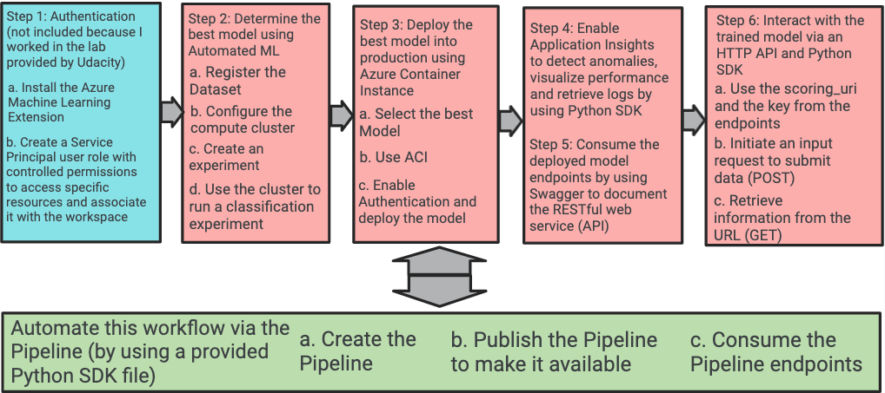

## Key Steps

**Step 1: Authentication**  *used the provided Udacity Lab*

**Step 2: Create the Automated ML Experiment**

 1. Registration of the dataset into Azure ML Studio:
 
*Figure 1: Datasets/ Bank-marketing*
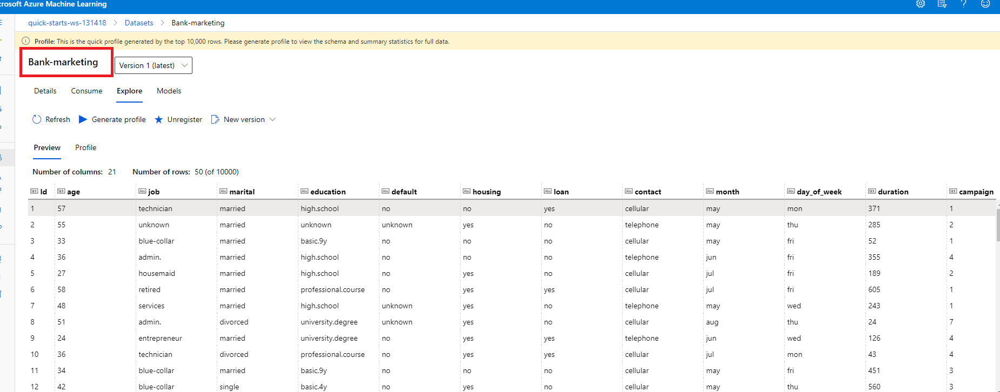

 2. Create the compute cluster using Standard_DS3_V2 as VM Size:

*Figure 2: Compute / cpu-clusters*

 3. We then configure and run the AutoML Part:
 
*Figure 3: Experiments / auto-ml-exp*
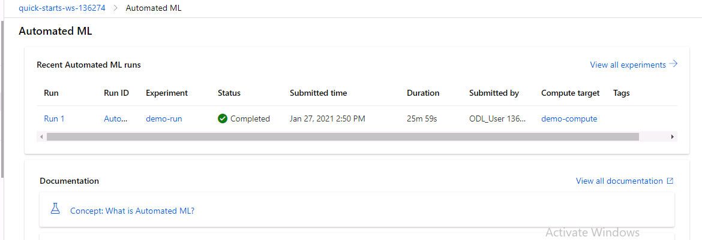

 4. Now retrieve the Best Model:
 
*Figure 4: Experiments / auto-ml-exp / Run 4 (completed)*
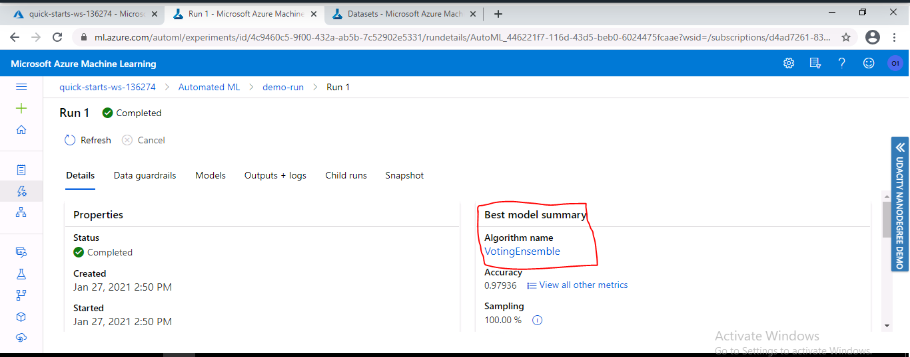

**Step 3: Deploy the Best Model**

 1. Let us start by deploying the best Model from the previous Auto ML experiment using ACI.

*Figure 5: Experiments / auto-ml-exp / Run 4 (Run 75 deployment)*

 2. To finally create the endpoints 
 
*Figure 6: Endpoints /mlops-model-deploy-bm  (Healthy)*

**Step 4: Enable Application Insights to retrieve logs **

 1. Where we start by provided logs.py by adding the name of the deployed model. 
 
*Figure 7: logs.py(Modification)*
 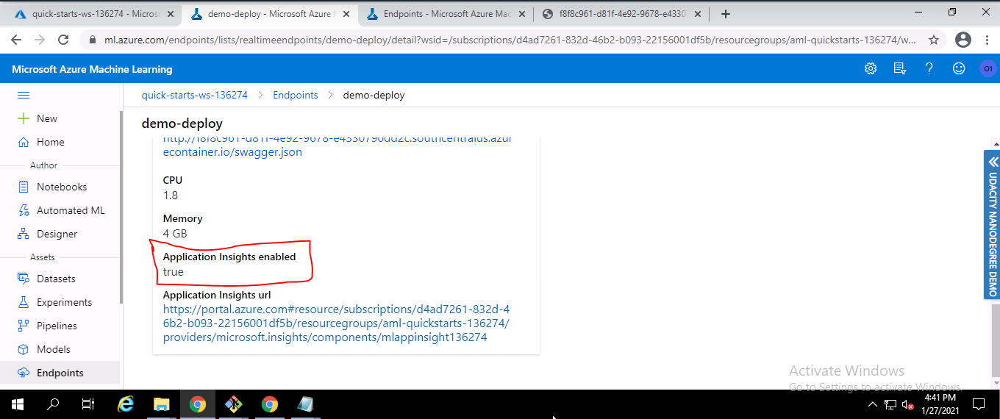
 
  2. we then execute the logs.py file 
  
*Figure 8: logs.py(Execution)*
  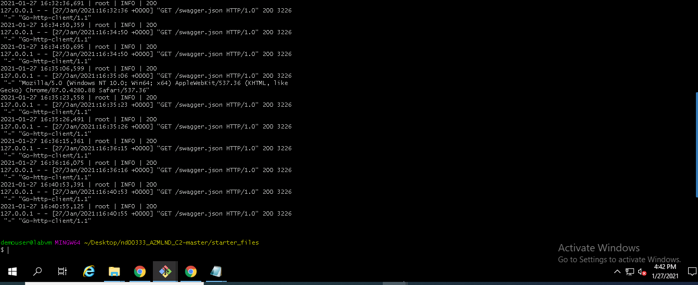
  
  3. To finally access to application insight  from the endpoints 
  
*Figure 9: Application insight*
 
 
 **Step 5: Consume the deployed model using Swagger**
 
  1. Where we start by downloading the swagger.json file associated with the deployed model
  
 *Figure 10: Swagger.json*
   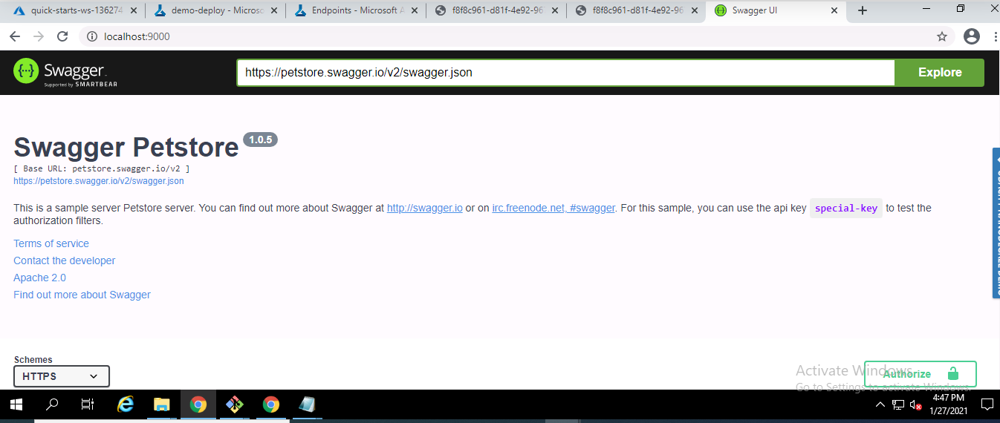
   
  2. We next execute the provided swagger.sh 
  
 *Figure 11: Swagger default page*
   
   
  3. To finally display the API Documentation of the model 
  
 *Figure 12: Swagger documentation associated to the model endpoints*
   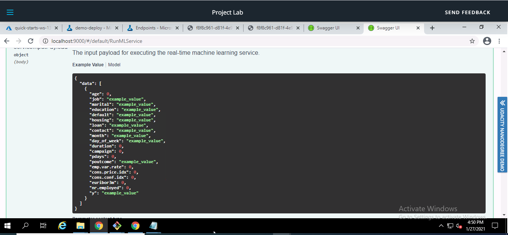
   
 **Step 6: Consume the Model Endpoints**
 
  1. Where we start by modifying a provided endpoints.py by adding the scoring_uri 
  
 *Figure 13: endpoint.py*
   
   
  2. To finally run the endpoint.py to interact with the trained model
  
 *Figure 14: Interaction with the model using endpoint.py*
   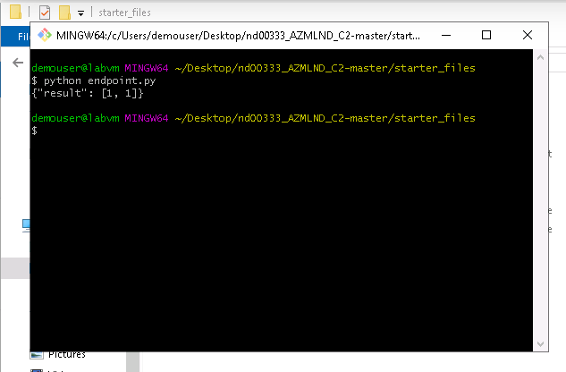
   
   **Step 7: Create, Publish and Consume a Pipeline to automate all these previous steps in one python SDK**

  1. Use aml-pipelines-with-automated-machine-learning-step.ipynb 
  
  2. Now download the config.json file and place it in the working directory
  
  3. And finally Run the different cells.
 
  *Figure 15: Pipeline creation (jupyter Notebook)*
  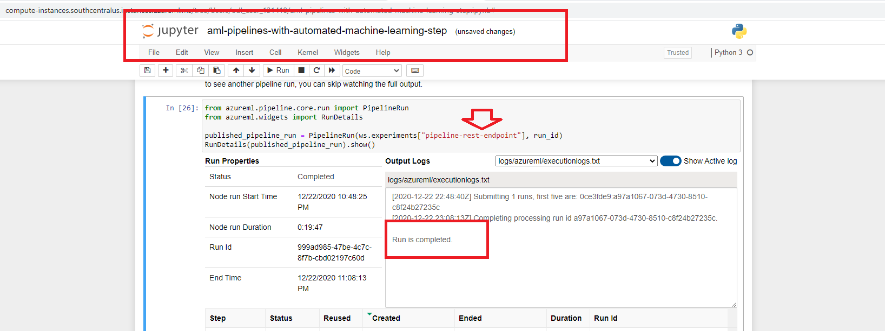
  
  *Figure 16: Pipeline creation (azure ml studio)*
  
  
  *Figure 17: Pipeline run overview (azure ml studio)*
  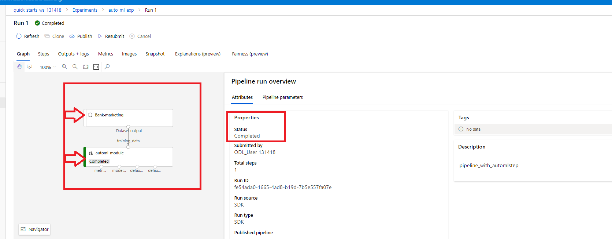
  
   *Figure 18: Pipeline experiments(azure ml studio)*
  
  
    . Create the Rest endpoint associated with the pipeline
    
   *Figure 19: Published pipeline overview*
 
   
   
*Figure 20 : deployment failed*

## Screen Recording Video: https://youtu.be/8SVF-T54hrE

My proposals for what's to come are related with the AutoML step where we need first to fix the adjusting issue which can prompt a dishonestly saw beneficial outcome of the model's exactness, we need additionally close to give additional time and even pick profound figuring out how to the AutoML analysis to test more model and convey a superior outcome
